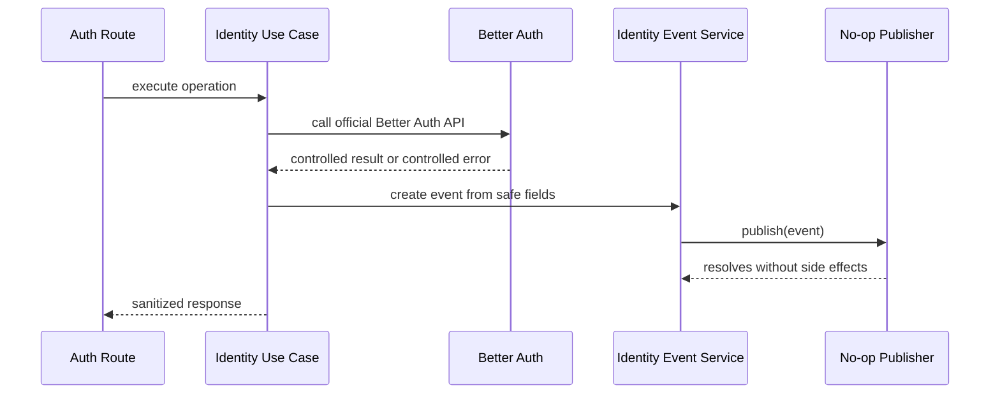

# Business Logic Model: Unit 1 Event Publication Foundation

## Purpose

Unit 1 introduces a stable internal event publication model for the IDP. The first implementation emits events through a no-op publisher interface so existing auth flows can be wired without introducing durable audit storage, queues, outbox processing, or external infrastructure.

## Business Capability

The IDP must produce consistent identity-event signals for authentication-related operations so future audit, monitoring, alerting, and service integrations can depend on a stable event contract.

## Event Emission Scope

Unit 1 wires event emission for all existing auth wrapper use cases:

- Sign up with email.
- Sign in with email.
- Sign out.
- Session lookup.
- Auth ok/status.
- Email verification.
- Verification email resend.
- Password reset request.
- Password reset completion.
- Password change.

## Event Lifecycle

### Text Alternative

Auth routes call identity use cases. Use cases call Better Auth official APIs. When the use case receives a controlled result or controlled Better Auth error/result, it creates a safe event and sends it through the identity event service. The identity event service delegates to the no-op publisher. The use case returns the normal sanitized response.

## Event Creation Flow

1. Use case executes the Better Auth operation.
2. Use case determines event name and operation label.
3. Use case classifies outcome as `succeeded`, `failed`, or `skipped`.
4. Use case includes request ID when available.
5. Use case includes internal user ID and tenant ID only when already known and safe.
6. Use case includes a safe reason code when available.
7. Event service validates the payload against the allowlist.
8. No-op publisher receives the event.

## Failure Event Flow

Failure events are emitted only when the use case receives a controlled Better Auth error/result. Unit 1 does not emit failure events for every thrown error because broad exception handling remains outside this unit's scope.

## Publisher Behavior

The Unit 1 publisher is no-op and cannot fail by design. The publisher interface is documented as best-effort for Unit 1. Future durable publishers must define explicit failure behavior before they replace the no-op implementation.

## Event Registry

Unit 1 introduces a durable event schema registry in code. The registry defines:

- Event names.
- Allowed payload fields.
- Operation labels.
- Outcome values.
- Safe reason-code pattern.

The functional design mirrors the registry so future documentation and audit work can trace the event contract.

## Business Logic Boundaries

- Unit 1 does not introduce persistent audit storage.
- Unit 1 does not introduce an event bus, queue, outbox, or worker.
- Unit 1 does not change Better Auth behavior or response semantics.
- Unit 1 does not log raw event payloads by default.
- Unit 1 does not add frontend behavior.

## Frontend Components

N/A. Unit 1 is backend-only and has no frontend/UI components.

## Security Compliance

- **SECURITY-03**: Event payloads remain no-PII and no-secret; no ad hoc production logging is introduced.
- **SECURITY-05**: Event payload creation uses an allowlist of fields.
- **SECURITY-11**: Event publication is isolated in `apps/idp/src/events`.
- **SECURITY-12**: Better Auth internals are not reimplemented or bypassed.
- **SECURITY-13**: The event abstraction preserves a future audit/integrity seam.
- **SECURITY-15**: No-op publisher cannot cause auth flows to fail open.

## PBT Compliance

- Unit 1 is not the primary PBT unit.
- Unit 1 avoids complex property-bearing transformations where possible.
- If event payload allowlist validation becomes a non-trivial sanitizer during implementation, the code generation plan must add PBT or defer the transformation to Unit 3's PBT setup.
