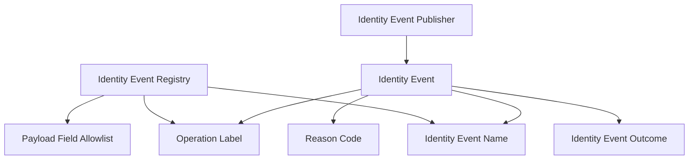

# Domain Entities: Unit 1 Event Publication Foundation

## Identity Event

### Purpose

Represents a safe, internal IDP event emitted by auth, tenant, membership, or bootstrap operations.

### Fields

| Field | Required | Description |
|---|---:|---|
| `name` | Yes | Stable event name from the registry. |
| `outcome` | Yes | `succeeded`, `failed`, or `skipped`. |
| `operation` | Yes | Safe operation label. |
| `reason_code` | No | Symbolic safe reason code. |
| `request_id` | No | Canonical request ID when available. |
| `user_id` | No | Internal user ID when already known and safe. |
| `tenant_id` | No | Internal tenant ID when already known and safe. |
| `occurred_at` | Yes | Event timestamp generated by the event service. |

### Forbidden Fields

The entity must not contain raw email, password, token, cookie, request body, response body, verification/reset URL, CPF, CNPJ, phone, address, session token, rendered email, provider response, or domain profile data.

## Identity Event Name

### Purpose

Defines the event taxonomy for Unit 1 and future units.

### Initial Values

- `identity.auth.sign_up`
- `identity.auth.sign_in`
- `identity.auth.sign_out`
- `identity.auth.session_lookup`
- `identity.auth.ok`
- `identity.auth.email_verified`
- `identity.auth.verification_email_requested`
- `identity.auth.password_reset_requested`
- `identity.auth.password_reset_completed`
- `identity.auth.password_changed`

### Future Values Reserved By Design

- `identity.tenant.created`
- `identity.tenant_domain.created`
- `identity.membership.owner_assigned`

## Identity Event Outcome

### Purpose

Represents the high-level result of the operation.

### Values

- `succeeded`
- `failed`
- `skipped`

## Operation Label

### Purpose

Provides a stable operation name that can align with existing safe auth operation labels and canonical event enrichment.

### Examples

- `sign_up_email`
- `sign_in_email`
- `sign_out`
- `get_session`
- `auth_ok`
- `verify_email`
- `send_verification_email`
- `request_password_reset`
- `reset_password`
- `change_password`

## Reason Code

### Purpose

Classifies controlled failures without exposing internal details.

### Examples

- `better_auth_rejected`
- `invalid_request`
- `not_authenticated`
- `unknown_controlled_failure`

## Identity Event Publisher

### Purpose

Interface for publishing events.

### Behavior

- Accepts an `IdentityEvent`.
- Returns `Promise<void>`.
- Initial implementation is no-op.
- Future implementations must define failure behavior before replacing no-op publisher.

## Identity Event Registry

### Purpose

Durable code-level registry that defines event names, operation labels, and payload field allowlist.

### Responsibilities

- Prevent arbitrary event names.
- Document allowed payload fields.
- Support tests that verify event contracts.
- Provide a stable source for future audit/event worker integration.

## Sensitive Data Assertion Helper

### Purpose

Test helper for verifying that events do not contain forbidden keys or representative forbidden values.

### Responsibilities

- Check event objects for forbidden field names.
- Check serialized event payloads for representative forbidden values supplied by tests.
- Stay test-only; not a runtime sanitizer unless later design changes.

## Entity Relationships

### Text Alternative

The event registry defines valid event names, operation labels, and allowed payload fields. Identity events use a valid event name, outcome, operation label, optional reason code, and safe identifiers. The event publisher accepts identity events.

## Security Compliance

- Entity fields are allowlisted to reduce leakage risk.
- Forbidden data is explicitly defined.
- Event publisher is isolated from auth internals.

## PBT Compliance

- Entity design avoids complex transformations in Unit 1.
- Test helper is example-based in Unit 1.
- PBT must be revisited if runtime sanitization becomes non-trivial.
