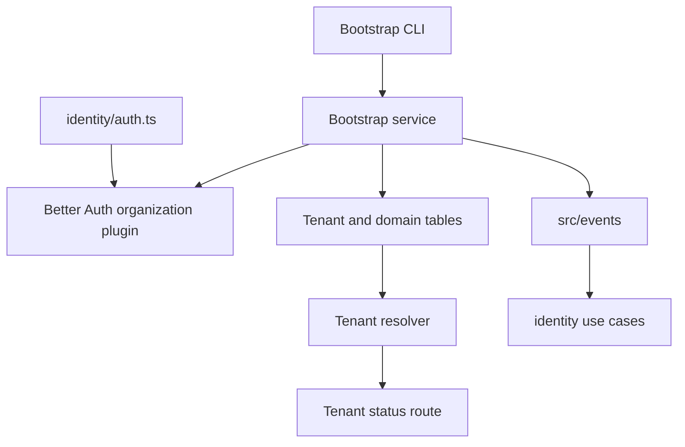

# Application Design

## Overview

This application design defines the high-level structure for the next `apps/idp` roadmap increment. The design introduces event publication, Better Auth organization support, IDP-owned tenant/domain registries, tenant resolution from request host, a safe tenant status endpoint, and bootstrap scripts.

## Design Decisions From User Answers

- Event publication abstraction lives in `apps/idp/src/events`.
- Initial event publisher is no-op only, with tests proving calls are made through the interface.
- Tenant/domain data uses dedicated IDP-owned tables for tenant metadata and domains/aliases, linked to Better Auth organization IDs.
- Host source strategy prefers trusted `X-Forwarded-Host` when present, falling back to `Host`.
- This cycle introduces a public tenant-resolution/status endpoint for frontend/API diagnostics.
- Bootstrap commands receive input through CLI flags only.
- Bootstrap creates a new Better Auth user with a provided temporary password for the initial owner path.
- Active/inactive membership status is documented as an extension path only in this cycle.
- `docs/initiatives/prds` and `docs/initiatives/tasks` updates are deferred until implementation is complete; AI-DLC artifacts drive this cycle.

## Component Documents

- `components.md` defines high-level components and responsibilities.
- `component-methods.md` defines method signatures and interface purposes.
- `services.md` defines service orchestration patterns.
- `component-dependency.md` defines dependency relationships and communication patterns.

## High-Level Component Architecture

### Text Alternative

The design adds `src/events` for event contracts and no-op publication. Existing identity use cases call the event service. Better Auth organization plugin is configured in the identity layer. Tenant and domain tables support host-based tenant resolution. A tenant status route exposes safe diagnostic status. Bootstrap CLI delegates tenant/domain/owner setup to a bootstrap service that uses Better Auth, the database, and event publication.

## Design Boundaries

- `apps/idp` is the only application package in scope.
- `apps/web` is out of scope.
- FastAPI implementation is out of scope.
- Business/resource authorization remains out of IDP.
- Better Auth internals are not reimplemented.
- Membership active/inactive behavior is not implemented yet beyond documenting the extension path.
- Persistent audit storage, event bus, queue, outbox, and monitoring dashboards remain out of scope.

## Application Design Completeness

- Components are identified and mapped to existing or new IDP layers.
- Component method surfaces are defined at a high level.
- Services and orchestration patterns are defined.
- Component dependencies and data flows are defined.
- Security and PBT implications are documented.
- Detailed business rules, exact schemas, transactions, and test implementation details remain for Functional Design and Construction stages.

## Security Compliance

- **SECURITY-01**: Applicable later to database/deployment configuration; design includes database tables but not infrastructure encryption config.
- **SECURITY-02**: N/A for this application design because no network intermediary is added.
- **SECURITY-03**: Compliant at design level; event and logging surfaces are no-PII by default.
- **SECURITY-04**: N/A because no HTML-serving endpoint is added.
- **SECURITY-05**: Compliant at design level; tenant status endpoint, host resolver, and CLI inputs require validation.
- **SECURITY-06**: N/A because no IAM policies are designed here.
- **SECURITY-07**: N/A because no network configuration is designed here.
- **SECURITY-08**: Compliant at design level; protected operations are separate from public diagnostics and Better Auth remains auth boundary.
- **SECURITY-09**: Compliant at design level; public responses must be generic and safe.
- **SECURITY-10**: Compliant at design level; any dependency additions must use pnpm and lockfile flow later.
- **SECURITY-11**: Compliant at design level; security-critical responsibilities are isolated in identity, events, tenant resolver, and bootstrap services.
- **SECURITY-12**: Compliant at design level; Better Auth owns credentials, sessions, and organization internals.
- **SECURITY-13**: Compliant at design level; event abstraction preserves future audit/integrity seam.
- **SECURITY-14**: Applicable later; event names and outcomes support future alerting design.
- **SECURITY-15**: Compliant at design level; tenant resolution and bootstrap are designed to fail safely.

## PBT Compliance

- **PBT-01**: Applicable in Functional Design; property-bearing components are identified.
- **PBT-02**: Potentially applicable if bootstrap parsing or host parsing introduces round-trip transformations.
- **PBT-03**: Applicable for event payload sanitization and host normalization invariants.
- **PBT-04**: Applicable for host normalization and bootstrap rerun/idempotency helpers.
- **PBT-05**: N/A at this design stage; no oracle is selected.
- **PBT-06**: Potentially applicable if stateful bootstrap or tenant workflows are modeled in Functional Design.
- **PBT-07**: Applicable later for domain-specific generators for hosts, event payload inputs, statuses, and CLI args.
- **PBT-08**: Applicable during Build and Test for seed/shrinking reproducibility.
- **PBT-09**: Applicable during NFR Requirements for selecting/configuring a TypeScript PBT framework.
- **PBT-10**: Applicable during Code Generation; PBT must complement example-based tests.
