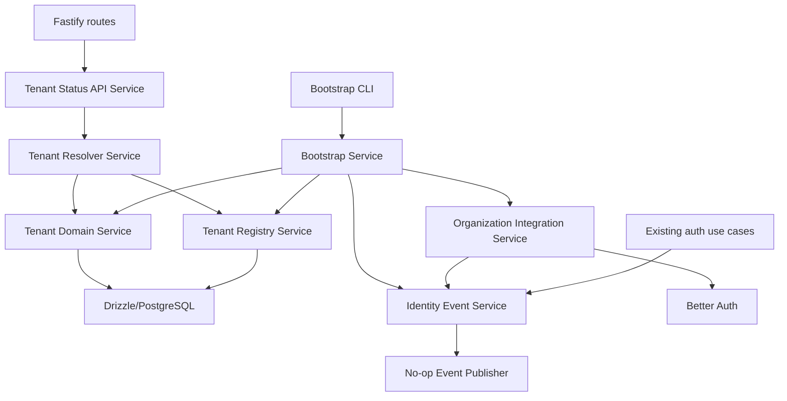
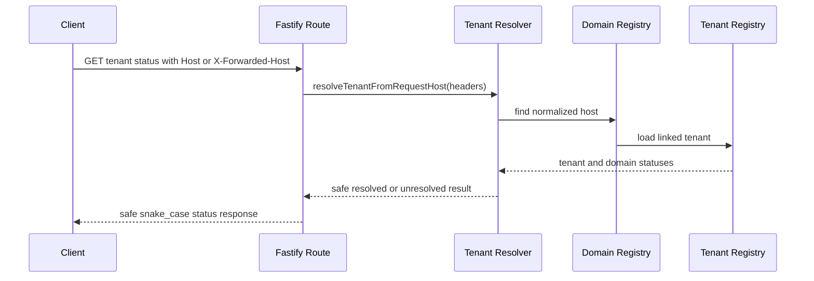
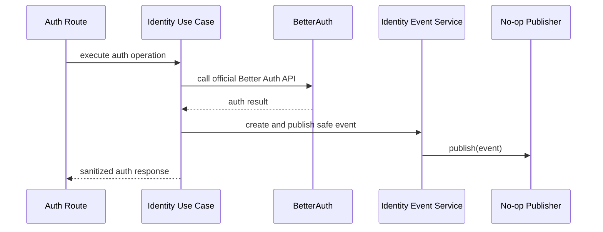

# Component Dependencies

## Dependency Diagram

### Text Alternative

Fastify routes call a tenant status API service, which uses the tenant resolver. The resolver depends on tenant/domain services backed by Drizzle/PostgreSQL. Bootstrap CLI calls the bootstrap service, which coordinates Better Auth organization operations, tenant/domain records, and event publication. Existing auth use cases call the identity event service through the publisher interface.

## Dependency Matrix

| Component | Depends On | Used By |
|---|---|---|
| Event Contracts | None | Event Service, tests, use cases |
| Event Publisher | Event Contracts | Event Service |
| Identity Event Service | Event Contracts, Event Publisher, Request Context | Auth use cases, Organization Integration Service, Bootstrap Service |
| Organization Integration Service | Better Auth, Identity Event Service | Bootstrap Service, future organization use cases |
| Tenant Registry Service | Drizzle DB, Identity Event Service | Tenant Resolver, Bootstrap Service, Tenant Status API |
| Tenant Domain Service | Drizzle DB, host normalization | Tenant Resolver, Bootstrap Service |
| Tenant Resolver Service | Tenant Registry Service, Tenant Domain Service | Tenant Status API, future auth/organization flows |
| Tenant Status API Service | Tenant Resolver Service, OpenAPI schemas | Fastify route |
| Bootstrap CLI | CLI parser, centralized config | Operators/package scripts |
| Bootstrap Service | Organization Integration, Tenant Registry, Tenant Domain, Event Service | Bootstrap CLI |

## Communication Patterns

- **Entrypoint to use case/service**: Fastify route handlers remain thin and call services/use cases.
- **Services to database**: Drizzle access is hidden behind tenant/domain repository/service functions.
- **Services to Better Auth**: Organization operations go through Better Auth official APIs/plugins.
- **Services to events**: Use cases call event service, not logger or future audit infrastructure directly.
- **CLI to services**: Bootstrap command parses and validates CLI flags, then delegates orchestration to bootstrap service.

## Data Flow: Tenant Status Endpoint

### Text Alternative

The tenant status route receives request headers, delegates host selection and resolution to the tenant resolver, which looks up normalized host data in the tenant domain registry and linked tenant registry. The route returns only a safe public status response.

## Data Flow: Existing Auth Event Emission

### Text Alternative

Auth routes call identity use cases. Use cases call Better Auth official APIs. After relevant outcomes, use cases ask the identity event service to create and publish a safe event through the no-op publisher. Responses remain sanitized.

## Coupling Constraints

- Tenant resolver must not import Fastify directly; route layer adapts Fastify headers to resolver input.
- Event contracts must not depend on Better Auth internal types that are unstable or private.
- Bootstrap service must not print or return secrets.
- Tenant/domain repositories must not expose raw database errors directly to public responses.
- Business API authorization rules must not be implemented in the IDP tenant resolver.

## Security Compliance

- Dependencies preserve separation of concerns for SECURITY-11.
- Public endpoint dependencies are structured to support input validation for SECURITY-05.
- Better Auth boundaries preserve SECURITY-12.
- Event publisher abstraction supports future audit integrity requirements under SECURITY-13.
- Safe failure and route/service separation support SECURITY-15.

## PBT Compliance

- Host normalization can be tested as a pure dependency of Tenant Domain Service.
- Event payload construction can be tested independently of Better Auth and Fastify.
- CLI parsing can be tested independently of database and Better Auth side effects.
