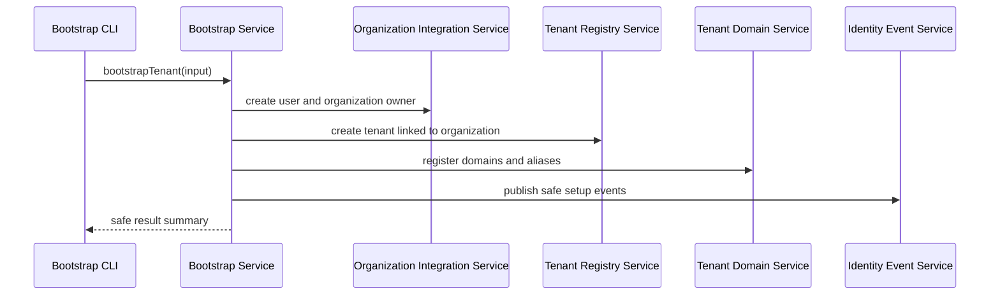

# Services

## Identity Event Service

- **Responsibilities**: Build and publish safe IDP events for auth, tenant, domain, and membership operations.
- **Orchestration**: Called by identity use cases, tenant services, and bootstrap service after relevant success/failure outcomes.
- **Dependencies**: Event contracts, event publisher implementation, request context when available.
- **Initial Implementation**: No-op publisher by default, with tests proving event publication calls happen through the interface.

## Organization Integration Service

- **Responsibilities**: Configure and call Better Auth organization APIs for tenant organization creation and owner assignment.
- **Orchestration**: Used by bootstrap service and later tenant/membership use cases.
- **Dependencies**: Better Auth server SDK, IDP auth config, event service.
- **Boundary**: Does not reimplement Better Auth organization, membership, permission, session, or credential internals.

## Tenant Registry Service

- **Responsibilities**: Manage IDP-owned tenant records linked to Better Auth organization IDs.
- **Orchestration**: Used by tenant resolver, bootstrap service, and tenant status endpoint.
- **Dependencies**: Drizzle database client, tenant repository, event service.
- **Boundary**: Does not own business-domain tenant data or resource authorization.

## Tenant Domain Service

- **Responsibilities**: Manage tenant domains and aliases, normalize lookup keys, and enforce domain status.
- **Orchestration**: Used by tenant resolver and bootstrap service.
- **Dependencies**: Host normalization helper, Drizzle repository, tenant registry service.
- **Boundary**: Does not rely on hardcoded host mappings.

## Tenant Resolver Service

- **Responsibilities**: Select host source, normalize host, query domain registry, evaluate tenant/domain status, return safe tenant context or safe failure state.
- **Orchestration**: Used by tenant status endpoint and later auth/organization flows that need tenant context.
- **Dependencies**: Tenant domain service, tenant registry service, request headers, trusted forwarded-host policy.
- **Security Behavior**: Unknown, malformed, pending, or disabled hosts fail closed for tenant-bound operations.

## Tenant Status API Service

- **Responsibilities**: Provide a safe public diagnostic response for current request host tenant/domain status.
- **Orchestration**: Fastify route calls tenant resolver and serializes safe `snake_case` response.
- **Dependencies**: Tenant resolver, OpenAPI schema definitions.
- **Security Behavior**: Does not expose internal IDs, realistic personal data, stack traces, or business-sensitive details.

## Bootstrap Service

- **Responsibilities**: Orchestrate tenant creation, domain/alias registration, Better Auth user creation with temporary password, owner membership assignment, and safe event emission.
- **Orchestration**: CLI command parses flags, loads centralized config, opens database/auth dependencies, calls bootstrap service, prints safe result.
- **Dependencies**: Organization integration service, tenant registry service, tenant domain service, event service, password policy/auth APIs, database transaction support.
- **Security Behavior**: Avoids printing secrets/PII, validates all inputs before mutation where practical, avoids unsafe duplication on rerun.

## Documentation And Roadmap Service

- **Responsibilities**: Not a runtime service. Implementation tasks must update docs and roadmap artifacts.
- **Artifacts**: `apps/idp/README.md`, `docs/idp/*`, `idp-architecture-discussion.md`, and AI-DLC artifacts.

## Service Orchestration Overview

### Text Alternative

The bootstrap CLI parses flags and calls the bootstrap service. The bootstrap service coordinates Better Auth organization/user operations, tenant records, tenant domain records, and safe event publication. It returns only a safe result summary to the CLI.
