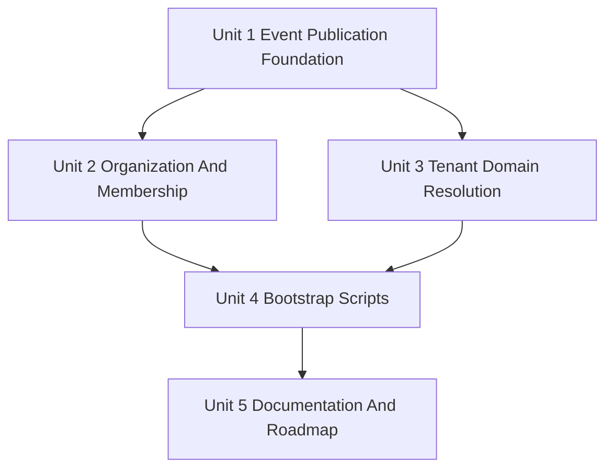

# Unit Of Work Dependencies

## Dependency Overview

### Text Alternative

Unit 1 must be completed first because later units emit events. Unit 2 and Unit 3 can be designed after Unit 1. Unit 2 owns Better Auth organization/membership schema work. Unit 3 owns tenant/domain lookup schema work. Unit 4 depends on both Unit 2 and Unit 3. Unit 5 follows implementation and verification work.

## Dependency Matrix

| Unit | Depends On | Blocks | Parallelization |
|---|---|---|---|
| Unit 1: Event Publication Foundation | None | Units 2, 3, 4 | Must run first |
| Unit 2: Organization And Membership | Unit 1 | Unit 4 | Can be designed in parallel with Unit 3 after Unit 1 |
| Unit 3: Tenant Domain Resolution | Unit 1 | Unit 4 | Can be designed in parallel with Unit 2 after Unit 1 |
| Unit 4: Bootstrap Scripts | Units 1, 2, 3 | Unit 5 | Runs after core implementation units |
| Unit 5: Documentation And Roadmap | Units 1, 2, 3, 4 | Completion | Runs after implementation verification |

## Migration Ownership

| Migration Area | Owning Unit | Notes |
|---|---|---|
| Better Auth organization plugin schema implications | Unit 2 | Must use Better Auth supported schema/plugin behavior. |
| Tenant metadata table | Unit 3 | Links tenant metadata to Better Auth organization IDs. |
| Tenant domain/alias lookup table | Unit 3 | Must support normalized host lookup and status. |
| Bootstrap-specific schema | Unit 4 | Avoid new schema if possible; use Unit 2 and Unit 3 models. |

## Recommended Execution Sequence

1. Unit 1: IDP Event Publication Foundation.
2. Unit 2: Better Auth Organization And Membership Model.
3. Unit 3: Tenant Domain And Alias Resolution.
4. Unit 4: IDP Bootstrap Scripts.
5. Unit 5: Documentation And Roadmap Finalization.

## Parallelization Notes

- The approved planning answer allowed parallelism after Unit 1, but the single developer/agent assumption means sequential execution is the default.
- Unit 2 and Unit 3 can be designed in parallel conceptually, but code generation should remain sequential unless explicit coordination is introduced.
- Unit 3 must own tenant-domain schema/migrations to avoid being blocked by Unit 2 migration scope.

## Testing Checkpoints

| Checkpoint | Units Covered | Verification Focus |
|---|---|---|
| Event tests | Unit 1 | Interface calls, no-op publisher, safe payload shape. |
| Organization config tests | Unit 2 | Plugin configuration, self-service disabled/inaccessible, Better Auth boundaries. |
| Tenant resolver tests | Unit 3 | Host source selection, normalization, status handling, public endpoint response. |
| PBT tests | Unit 3 | Host normalization and lookup-key invariants. |
| Bootstrap tests | Unit 4 | CLI parsing, safe output, orchestration, rerun behavior. |
| Documentation review | Unit 5 | README/docs/roadmap reflect verified behavior. |

## Risk Dependencies

- Unit 2 schema decisions may affect Unit 3 tenant organization foreign keys.
- Unit 3 host resolution behavior affects Unit 4 domain bootstrap validation.
- Unit 4 operational safety depends on Units 1, 2, and 3 being stable.
- Unit 5 must not mark roadmap items complete until implementation verification is complete.

## Security Compliance

- Dependency sequence preserves security-first foundations before bootstrap operations.
- Public tenant status endpoint is isolated in Unit 3 and does not depend on bootstrap scripts.
- Bootstrap scripts do not run before event, organization, tenant, and domain foundations exist.

## PBT Compliance

- Unit 3 is the primary PBT unit.
- PBT dependency setup should be planned before Unit 3 code generation.
- If Unit 1, Unit 2, or Unit 4 introduce unavoidable property-bearing pure helpers, their code generation plans must add PBT coverage despite Unit 3 primary ownership.
