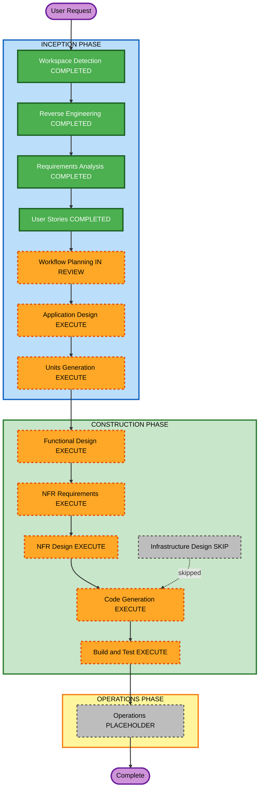

# Execution Plan

## Detailed Analysis Summary

### Transformation Scope

- **Transformation Type**: Single application architectural enhancement inside `apps/idp`.
- **Primary Changes**: Add event publication abstraction, Better Auth organization support, tenant/membership ownership model, tenant domain/alias resolution, bootstrap scripts, database migrations, tests, and documentation.
- **Related Components**: `apps/idp/src/identity`, `apps/idp/src/usecases`, `apps/idp/src/entrypoint`, `apps/idp/src/database`, future `apps/idp/src/events`, `apps/idp/tests`, `apps/idp/package.json`, `apps/idp/README.md`, `docs/idp`, `docs/initiatives/prds`, `docs/initiatives/tasks`, `idp-architecture-discussion.md`.

### Change Impact Assessment

- **User-facing changes**: Indirect. Institutional owners, internal users, platform operators, and future API consumers receive safer tenant and membership behavior, but `apps/web` is out of scope.
- **Structural changes**: Yes. New IDP event abstraction, organization plugin configuration, tenant resolver, and bootstrap command surface are expected.
- **Data model changes**: Yes. Better Auth organization plugin tables and tenant/domain registry fields or tables are expected through Drizzle migrations.
- **API changes**: Likely. New or changed IDP internal/custom endpoints may be needed for tenant context, organization/membership, or bootstrap-adjacent verification; all custom routes require OpenAPI metadata.
- **NFR impact**: High. Security, auditability, logging safety, fail-closed tenant resolution, PBT, and regression coverage are core requirements.

### Component Relationships

- **Primary Component**: `apps/idp`.
- **Infrastructure Components**: Existing Docker/CI/CD/deployment workflows may need documentation or env updates, but no infrastructure rewrite is planned.
- **Shared Components**: None active; do not create shared packages unless later design proves real reuse.
- **Dependent Components**: Future FastAPI/business APIs will consume IDP tenant/membership context later; `apps/web` remains out of this cycle.
- **Supporting Components**: IDP tests, Drizzle migrations, OpenAPI docs, durable docs, PRD/task docs.

| Component | Change Type | Change Reason | Priority |
|---|---|---|---|
| `apps/idp/src/identity` | Major | Better Auth organization plugin, auth event integration | Critical |
| `apps/idp/src/events` | Major | New internal event publication abstraction | Critical |
| `apps/idp/src/database` | Major | Organization plugin schema and tenant/domain registry | Critical |
| `apps/idp/src/usecases` | Major | Tenant, membership, bootstrap, and event-aware behaviors | Critical |
| `apps/idp/src/entrypoint` | Minor to Major | Custom routes/OpenAPI if required by design | Important |
| `apps/idp/tests` | Major | Example-based and PBT coverage | Critical |
| `docs/idp`, `docs/initiatives/prds`, `docs/initiatives/tasks` | Major | Durable design and execution documentation | Important |
| `apps/web` | None | Explicitly out of scope | N/A |

### Risk Assessment

- **Risk Level**: High.
- **Rollback Complexity**: Difficult if database migrations and Better Auth plugin schema are introduced; code rollback must account for migration compatibility.
- **Testing Complexity**: Complex because security-sensitive auth, tenant resolution, Better Auth plugin behavior, bootstrap scripts, and property-based tests are involved.

## Workflow Visualization

### Text Alternative

The workflow completed Workspace Detection, Reverse Engineering, Requirements Analysis, and User Stories. Workflow Planning is now in review. The recommended next stages are Application Design, Units Generation, per-unit Functional Design, NFR Requirements, NFR Design, Code Generation, and Build and Test. Infrastructure Design is skipped because no cloud/network/deployment architecture changes are planned in this cycle.

## Phases to Execute

### Inception Phase

- [x] Workspace Detection - COMPLETED.
- [x] Reverse Engineering - COMPLETED.
- [x] Requirements Analysis - COMPLETED.
- [x] User Stories - COMPLETED.
- [x] Workflow Planning - IN REVIEW.
- [ ] Application Design - EXECUTE.
  - **Rationale**: New logical components and dependencies must be defined: event publisher, tenant resolver, organization plugin boundary, bootstrap command surface, and database ownership model.
- [ ] Units Generation - EXECUTE.
  - **Rationale**: The work decomposes naturally into multiple implementation units with distinct design, test, and migration risks.

### Construction Phase

- [ ] Functional Design - EXECUTE.
  - **Rationale**: New data models, host resolution rules, event payload rules, bootstrap behavior, and membership status semantics require detailed design.
- [ ] NFR Requirements - EXECUTE.
  - **Rationale**: Security Baseline and PBT are enabled, and the work has strong logging, fail-closed, auditability, testability, and migration requirements.
- [ ] NFR Design - EXECUTE.
  - **Rationale**: NFR constraints must be translated into concrete patterns for validation, logging, redaction, PBT, safe errors, and migration/rollback handling.
- [ ] Infrastructure Design - SKIP.
  - **Rationale**: No cloud/network/load balancer/deployment architecture changes are currently required. Runtime env/docs may change, but those can be handled in code generation and documentation tasks.
- [ ] Code Generation - EXECUTE.
  - **Rationale**: Implementation planning and code generation are required for all selected units.
- [ ] Build and Test - EXECUTE.
  - **Rationale**: The cycle must finish with typecheck, lint/check, unit/PBT coverage, build, and documented verification instructions.

### Operations Phase

- [ ] Operations - PLACEHOLDER.
  - **Rationale**: AI-DLC operations workflow is a placeholder; deployment/monitoring changes are not part of this cycle unless discovered as documentation-only impacts.

## Proposed Units Of Work

### Unit 1: IDP Event Publication Foundation

- **Goal**: Add a stable internal event publication abstraction and emit safe events from existing auth flows.
- **Primary story**: US-01.
- **Primary areas**: `apps/idp/src/events`, `apps/idp/src/usecases/identity`, `apps/idp/src/identity`, tests, docs.
- **Key risks**: PII leakage, ad hoc logging replacing event semantics, event failures affecting auth behavior incorrectly.

### Unit 2: Better Auth Organization And Membership Model

- **Goal**: Add Better Auth organization plugin support and model institutional tenant/membership ownership boundaries.
- **Primary story**: US-02.
- **Primary areas**: `apps/idp/src/identity/auth.ts`, `apps/idp/src/database/schema.ts`, Drizzle migrations, use cases/tests/docs.
- **Key risks**: Better Auth plugin schema mismatch, public organization creation accidentally enabled, citizen users incorrectly treated as members, hard deletion harming auditability.

### Unit 3: Tenant Domain And Alias Resolution

- **Goal**: Resolve tenant context from trusted original host using a domain/alias registry and safe status handling.
- **Primary story**: US-03.
- **Primary areas**: tenant resolver module, database schema/migrations, request context integration, tests, docs.
- **Key risks**: Host header trust mistakes, unknown-host information leaks, malformed host bypasses, missing indexes for domain lookup.

### Unit 4: IDP Bootstrap Scripts

- **Goal**: Add controlled scripts for creating tenants, registering domains/aliases, and creating or assigning initial owner users.
- **Primary story**: US-04.
- **Primary areas**: `apps/idp` scripts, package scripts, database/auth integration, tests, README/docs.
- **Key risks**: Unsafe reruns, leaked secrets/PII in output, partial owner assignment after validation failures, operational ambiguity.

## Package Change Sequence

- **Update Approach**: Sequential within `apps/idp`.
- **Critical Path**: Event abstraction and organization schema should precede tenant resolution and bootstrap scripts.
- **Coordination Points**: Better Auth plugin schema, Drizzle migrations, tenant/domain data model, event payload contract, package scripts, documentation.
- **Testing Checkpoints**: Unit/PBT after pure helpers; route/usecase tests after integration points; migration generation verification before build/test.

Recommended sequence:

1. `apps/idp` event abstraction foundation.
2. `apps/idp` Better Auth organization plugin and schema/migration design.
3. `apps/idp` tenant/domain registry and host resolver.
4. `apps/idp` bootstrap scripts and operational docs.
5. `docs/**`, `apps/idp/README.md`, and `idp-architecture-discussion.md` updates as part of each relevant unit or final documentation pass.

## Estimated Timeline

- **Total Remaining AI-DLC Stages**: 8 recommended executable stages before completion.
- **Estimated Duration**: Multi-session implementation. This scope should not be treated as a single small edit because it includes schema, auth plugin behavior, PBT, scripts, and docs.

## Success Criteria

- **Primary Goal**: Finish the selected IDP roadmap increment while preserving security, tenant isolation, audit readiness, and Better Auth boundaries.
- **Key Deliverables**: Event abstraction, organization/membership configuration, tenant/domain resolver, bootstrap scripts, migrations, tests, docs, updated roadmap.
- **Quality Gates**: Biome/check, typecheck, unit tests, PBT where applicable, coverage, build, security compliance review, PBT compliance review, documentation review.
- **Integration Testing**: `fastify.inject()` and use-case tests cover new auth/tenant behavior without real external services.
- **Operational Readiness**: Bootstrap commands are documented, safe to run in approved environments, and do not log secrets or sensitive data.

## Security Compliance

- Security Baseline remains enabled and blocking.
- Workflow plan includes dedicated design and NFR stages to address SECURITY-03, SECURITY-05, SECURITY-08, SECURITY-09, SECURITY-10, SECURITY-11, SECURITY-12, SECURITY-13, and SECURITY-15 before code generation.
- SECURITY-01, SECURITY-02, SECURITY-06, SECURITY-07, and SECURITY-14 are applicable only if later design introduces infrastructure, IAM, storage, or monitoring changes beyond current scope.
- No blocking security finding is introduced by this planning artifact.

## PBT Compliance

- PBT remains enabled and blocking.
- Workflow plan includes Functional Design, NFR Requirements, NFR Design, Code Generation, and Build/Test stages where PBT identification, framework selection, generator quality, seed/shrinking reproducibility, and complementary example-based testing will be enforced.
- No blocking PBT finding is introduced by this planning artifact.
