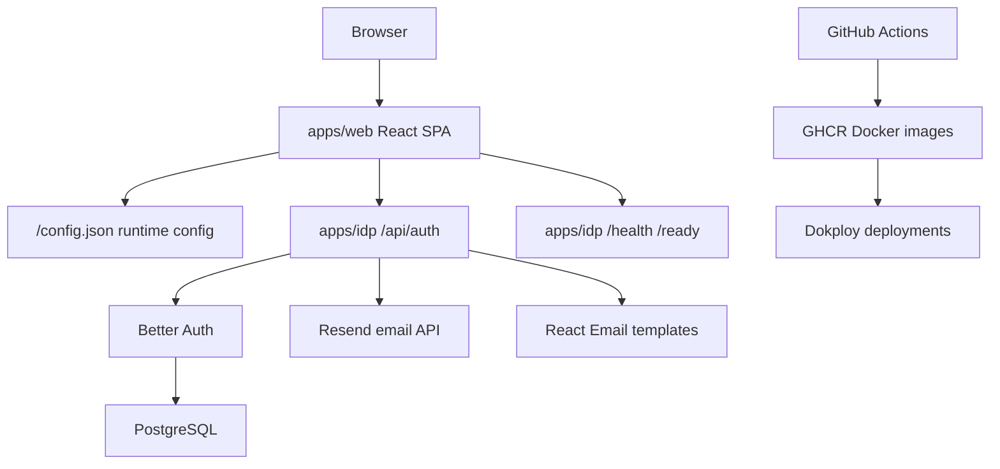
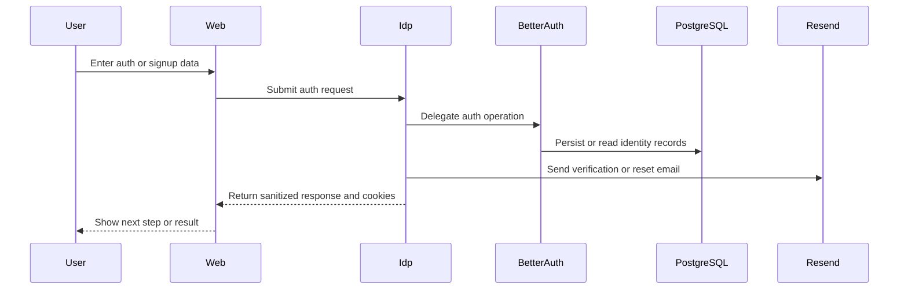

# System Architecture

## System Overview

SAC Nexus is a pnpm/Turborepo monorepo with two active applications. `apps/web` is a Vite React single-page application focused on auth and onboarding screens. `apps/idp` is a Fastify identity provider that wraps Better Auth, Drizzle/PostgreSQL, Resend, React Email, OpenAPI, and operational endpoints.

## Architecture Diagram

### Text Alternative

The browser loads `apps/web`. The web app loads runtime public config and is intended to call `apps/idp` auth endpoints. IDP delegates auth internals to Better Auth, persists identity data in PostgreSQL, and sends auth email through Resend using React Email templates. GitHub Actions build Docker images, publish them to GHCR, and trigger Dokploy deployments.

## Component Descriptions

### apps/web
- **Purpose**: User-facing SPA for sign-in and signup journeys.
- **Responsibilities**: Routes, forms, client-side validation, UI composition, runtime config, testable auth/onboarding workflows.
- **Dependencies**: React, Vite, TanStack Router, TanStack Query, ky, Zod, React Hook Form, Tailwind CSS, Vitest, Playwright.
- **Type**: Application.

### apps/idp
- **Purpose**: Identity provider service.
- **Responsibilities**: Auth endpoints, Better Auth integration, session-cookie handling, email verification, password reset/change, sanitized responses, OpenAPI, operational endpoints.
- **Dependencies**: Fastify, Better Auth, Drizzle ORM, PostgreSQL, Resend, React Email, Zod, Vitest.
- **Type**: Application/service.

### .github/workflows and .github/actions
- **Purpose**: CI/CD automation.
- **Responsibilities**: Quality gates, security audit, Docker build/scan/publish, migrations, Dokploy deployment, rollback.
- **Dependencies**: GitHub Actions, pnpm, Turbo, Trivy, GHCR, Dokploy.
- **Type**: Infrastructure/automation.

## Data Flow

### Text Alternative

Users submit signup or auth data in the web app. The intended production path is for web to call IDP auth endpoints. IDP delegates security-critical auth operations to Better Auth, Better Auth uses PostgreSQL, and IDP sends verification/reset email through Resend. Responses are sanitized before returning to clients.

## Integration Points

- **External APIs**: Resend email API for transactional auth emails.
- **Databases**: PostgreSQL for IDP users, sessions, accounts, and verification records.
- **Third-party Services**: Better Auth library for authentication internals; GHCR and Dokploy for deployment delivery.

## Infrastructure Components

- **CDK Stacks**: None detected.
- **Terraform**: None detected.
- **Deployment Model**: Docker images built by GitHub Actions, published to GHCR, and deployed by Dokploy webhooks.
- **Networking**: Web runtime serves static SPA through Nginx. IDP serves Fastify HTTP API on port 3001 by default.
