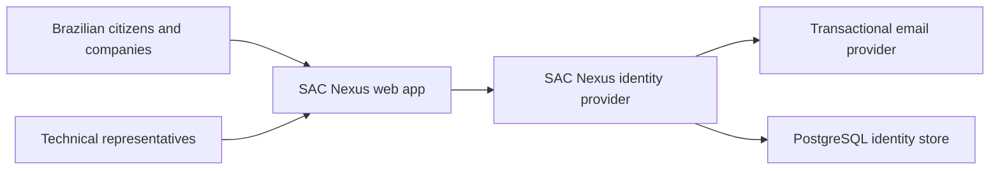

# Business Overview

## Business Context Diagram

### Text Alternative

Users interact with the web application for sign-in and registration. The web application is expected to integrate with the identity provider for authentication. The identity provider sends transactional auth email through Resend and stores auth-owned data in PostgreSQL.

## Business Description

- **Business Description**: SAC Nexus currently provides authentication and onboarding foundations for a Brazilian SAC platform. The implemented scope centers on account registration, sign-in, verified email, password management, session handling, and operational readiness for the identity service.
- **Business Transactions**: Account type selection, individual registration, company registration, technical responsible registration, email/password sign-in, email verification, password reset, password change, session lookup, sign-out, health check, readiness check.
- **Business Dictionary**: CPF means Brazilian individual taxpayer document. CNPJ means Brazilian company taxpayer document. CEP means Brazilian postal code. UF means Brazilian federative unit. Responsavel Tecnico means a technical representative tied to professional or company accountability.

## Component Level Business Descriptions

### apps/web
- **Purpose**: Browser application for user-facing sign-in and onboarding flows.
- **Responsibilities**: Render Brazilian Portuguese auth UI, validate local signup data, drive multi-step signup flows, preserve safe draft preferences in session storage, load runtime public configuration.

### apps/idp
- **Purpose**: Dedicated identity provider for SAC Nexus.
- **Responsibilities**: Manage email/password auth, verified-email enforcement, session cookies, password reset/change, auth email delivery, auth-owned PostgreSQL persistence, operational health/readiness endpoints.

### Repository Infrastructure
- **Purpose**: Monorepo orchestration and delivery foundation.
- **Responsibilities**: Coordinate pnpm workspaces, Turborepo tasks, formatting/linting/testing, Docker image builds, CI/CD gates, GitHub Actions deployment workflows.
