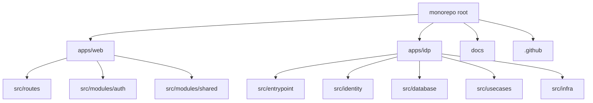

# Code Structure

## Build System

- **Type**: pnpm workspace with Turborepo orchestration.
- **Configuration**: Root `package.json`, `pnpm-workspace.yaml`, `turbo.json`, app-level `package.json` scripts.
- **Active Workspaces**: `apps/web`, `apps/idp`.
- **Reserved Workspaces**: `packages/*` is configured but no active shared package was detected.

## Key Modules

### Text Alternative

The repository root coordinates app workspaces, docs, and GitHub automation. The web app separates routes, auth module, and shared UI/config/API utilities. The IDP separates entrypoint composition, identity integration, database, use cases, and infrastructure helpers.

## Existing Files Inventory

- `package.json` - Root scripts delegate to Turbo and pin pnpm.
- `pnpm-workspace.yaml` - Defines `apps/*` and `packages/*` workspaces.
- `turbo.json` - Defines build, check, dev, format, lint, test, coverage, and typecheck tasks.
- `biome.json` - Root formatter/linter/import organization and Tailwind sorting configuration.
- `lefthook.yml` - Local git hooks for Biome, Commitlint, and pre-push checks.
- `.github/workflows/*.yml` - Web and IDP CI/CD, staging, production, develop, and rollback workflows.
- `.github/actions/*/action.yml` - Shared Node/pnpm setup, workspace-change detection, and Dokploy webhook actions.
- `apps/web/src/main.tsx` - Web bootstrap, runtime config loading, QueryClient, RouterProvider.
- `apps/web/src/routes/**` - TanStack Router file-based routes.
- `apps/web/src/modules/auth/**` - Sign-in, signup hub, signup wizards, schemas, components, and draft helpers.
- `apps/web/src/modules/shared/**` - Shared config, API client, form controls, UI primitives, validators, formatters.
- `apps/web/tests/**` - Unit/component and Playwright E2E coverage.
- `apps/idp/src/server.ts` - IDP executable server entrypoint.
- `apps/idp/src/entrypoint/**` - Fastify app composition, plugins, route registration, OpenAPI contracts.
- `apps/idp/src/identity/**` - Better Auth, email delivery, password policy, auth email templates.
- `apps/idp/src/database/**` - Drizzle schema, PostgreSQL client, migration runner.
- `apps/idp/src/usecases/**` - Operational and identity use cases.
- `apps/idp/src/infra/**` - Request IDs, logging, and HTTP infrastructure.
- `apps/idp/drizzle/**` - Generated SQL migrations and metadata.
- `apps/idp/tests/**` - Unit tests for app, auth, database, logging, and operational behavior.

## Design Patterns

### Module Boundary Pattern
- **Location**: `apps/web/src/modules/*`.
- **Purpose**: Keep feature code grouped by business module and expose public APIs via module index files.
- **Implementation**: Auth routes import page-level exports from `src/modules/auth`.

### Layered Service Pattern
- **Location**: `apps/idp/src`.
- **Purpose**: Keep Fastify entrypoint concerns separate from use cases, identity integration, database, and infrastructure helpers.
- **Implementation**: Routes call use cases, use cases call explicit identity service methods, and Better Auth owns auth internals.

### Runtime Configuration Pattern
- **Location**: `apps/web/src/modules/shared/config` and web Docker entrypoint.
- **Purpose**: Avoid baking deploy-time public URLs into the static bundle.
- **Implementation**: Production fetches `/config.json`; development falls back to Vite env defaults.

## Critical Dependencies

### React and Vite
- **Usage**: `apps/web` UI runtime and build tool.
- **Purpose**: SPA rendering and bundling.

### TanStack Router
- **Usage**: File-based routes in `apps/web/src/routes`.
- **Purpose**: Type-safe client routing and search-param validation.

### Fastify
- **Usage**: `apps/idp` HTTP server.
- **Purpose**: API framework, route plugins, lifecycle hooks.

### Better Auth
- **Usage**: `apps/idp/src/identity/auth.ts`.
- **Purpose**: Email/password auth, sessions, verification, reset/change password internals.

### Drizzle ORM and PostgreSQL
- **Usage**: `apps/idp/src/database` and `apps/idp/drizzle`.
- **Purpose**: Identity persistence and migrations.

### Resend and React Email
- **Usage**: `apps/idp/src/identity/email-delivery.ts` and email templates.
- **Purpose**: Transactional auth email delivery.
