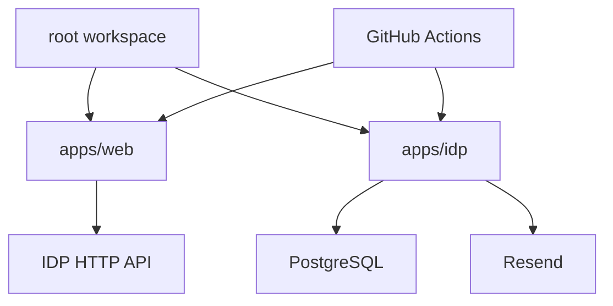

# Dependencies

## Internal Dependencies

### Text Alternative

The root workspace orchestrates `apps/web` and `apps/idp`. There are no direct local package dependencies between web and IDP. Web is intended to communicate with IDP through HTTP runtime configuration. IDP depends on PostgreSQL and Resend at runtime. GitHub Actions build, test, package, and deploy both apps.

### Root workspace depends on apps/web and apps/idp
- **Type**: Build/test orchestration.
- **Reason**: Root scripts delegate tasks to Turbo across workspaces.

### apps/web depends on apps/idp HTTP contract
- **Type**: Runtime integration, not a package import.
- **Reason**: Web auth flows are intended to call IDP auth endpoints through runtime URLs or proxy configuration.

### apps/idp depends on PostgreSQL
- **Type**: Runtime persistence.
- **Reason**: Better Auth and Drizzle store users, sessions, accounts, and verification records.

### apps/idp depends on Resend
- **Type**: Runtime external service.
- **Reason**: Auth verification and password-reset emails are delivered through Resend.

## External Dependencies

### React
- **Version**: Declared in `apps/web/package.json`.
- **Purpose**: SPA UI rendering.
- **License**: See package metadata in lockfile/npm registry.

### Vite
- **Version**: Declared in `apps/web/package.json`.
- **Purpose**: Web development/build pipeline.
- **License**: See package metadata in lockfile/npm registry.

### Fastify
- **Version**: Declared in `apps/idp/package.json`.
- **Purpose**: IDP HTTP API framework.
- **License**: See package metadata in lockfile/npm registry.

### Better Auth
- **Version**: Declared in `apps/idp/package.json`.
- **Purpose**: Authentication internals.
- **License**: See package metadata in lockfile/npm registry.

### Drizzle ORM and pg
- **Version**: Declared in `apps/idp/package.json`.
- **Purpose**: PostgreSQL schema, migrations, and connectivity.
- **License**: See package metadata in lockfile/npm registry.

### Resend
- **Version**: Declared in `apps/idp/package.json`.
- **Purpose**: Transactional email delivery.
- **License**: See package metadata in lockfile/npm registry.

### Zod
- **Version**: Declared in app package manifests.
- **Purpose**: Runtime validation for frontend schemas and backend env/config.
- **License**: See package metadata in lockfile/npm registry.
